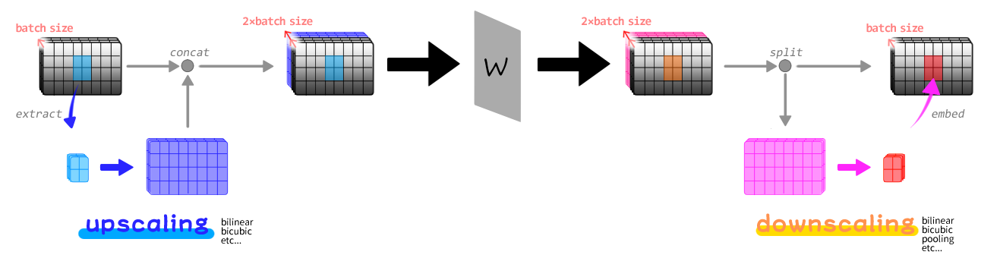

# LLuL - Local Latent upscaLer

https://user-images.githubusercontent.com/120772120/221390831-9fbccdf8-5898-4515-b988-d6733e8af3f1.mp4

## What is this?

This is an extension for [stable-diffusion-webui](https://github.com/AUTOMATIC1111/stable-diffusion-webui) which lets you to upscale latents locally.

See above image. This is all what this extension does.

## Usage

1. Select `Enabled` checkbox.
2. Move gray box where you want to apply upscaling.
3. Generate image.

## Examples

- Weight 0.00 -> 0.20 Animation

https://user-images.githubusercontent.com/120772120/221390834-7e2c1a1a-d7a6-46b0-8949-83c4d5839c33.mp4

## How it works

