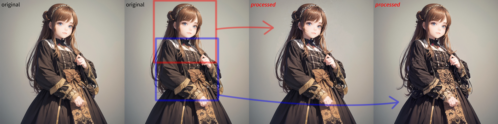
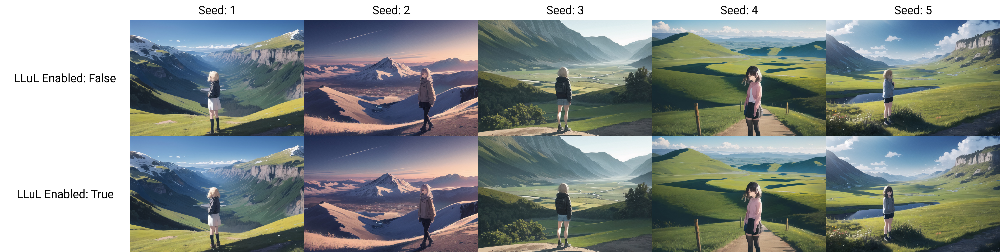
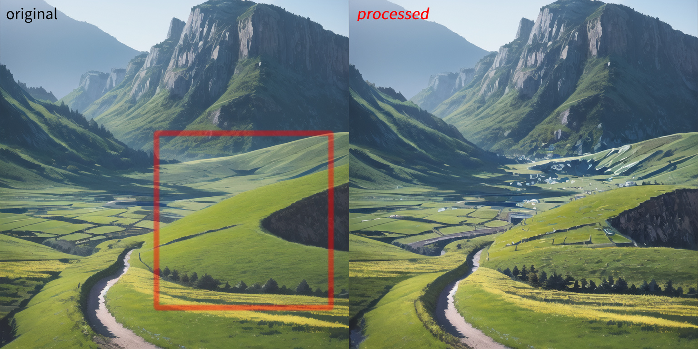
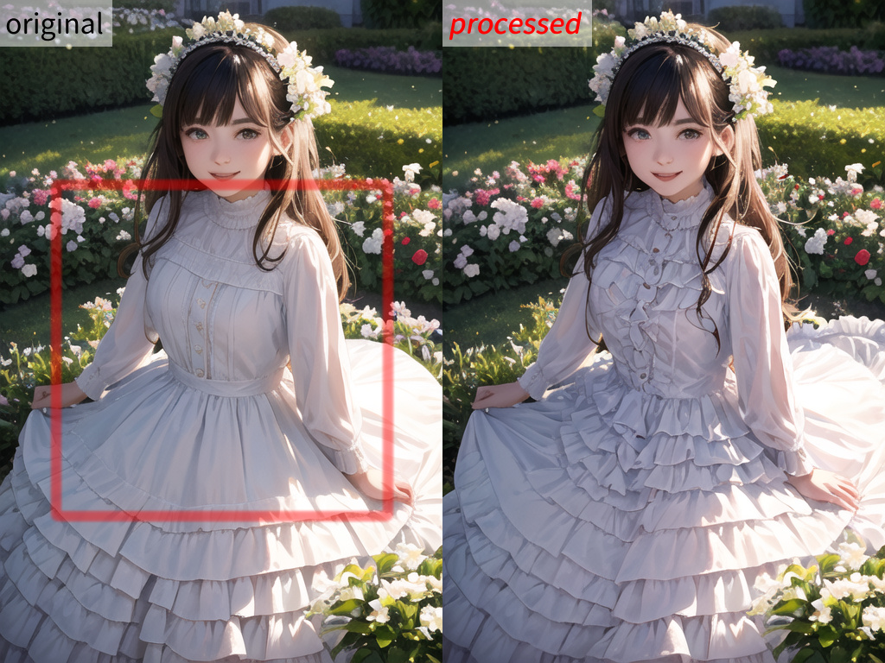

# LLuL - Local Latent upscaLer

https://github.com/hnmr293/sd-webui-llul/blob/master/images/cover.mp4

## What is this?

This is an extension for [stable-diffusion-webui](https://github.com/AUTOMATIC1111/stable-diffusion-webui) which lets you to upscale latents locally.

See above image. This is all what this extension does.

## Usage

1. Select `Enabled` checkbox.
2. Move gray box where you want to apply upscaling.
3. Generate image.

## Examples

- Weight 0.00 -> 0.20 Animation

https://github.com/hnmr293/sd-webui-llul/blob/master/images/llul.mp4
